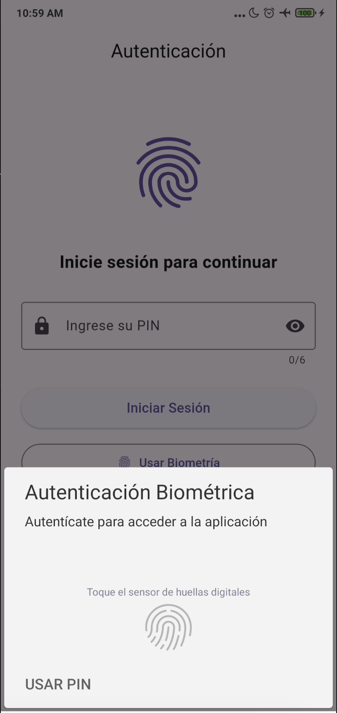

# Seek Challenge

Aplicación móvil de escaneo de códigos QR con autenticación biométrica desarrollada con Flutter y módulos nativos en Android (Kotlin).

## Pantallas
| Autenticación Biométrica | Home | Detalle QR |Escaneo de QR |
|--------------------------|------|------------|-----------------|
| |  |  |


## Características

- **Escaneo de Códigos QR**
  - Procesamiento nativo con CameraX para optimizar rendimiento
  - Detección de códigos QR usando ML Kit
  - Almacenamiento local de los códigos escaneados

- **Autenticación Biométrica**
  - Soporte para huella digital y reconocimiento facial
  - Fallback a autenticación por PIN
  - Almacenamiento seguro de credenciales

- **Arquitectura**
  - Implementación de Clean Architecture
  - Gestión de estado con BLoC en Flutter
  - Comunicación con código nativo mediante Method Channels y Pigeon

## Requisitos previos

- Flutter SDK 3.29.0
- Dart SDK 3.7.0
- Android SDK 21 (mínimo) → Recomendado: 33 o superior
- Kotlin 1.7.10 o superior
- Dispositivo con soporte para biometría (para probar todas las funcionalidades)

## Configuración del proyecto

1. Clonar el repositorio:
```bash
git clone https://github.com/kbrr11/seek_challenge.git
cd seek_challenge
```

2. Obtener dependencias:
```bash
flutter pub get
```

3. Generar código necesario:
```bash
flutter pub run build_runner build --delete-conflicting-outputs
```

4. Ejecutar la aplicación:
```bash
flutter run
```

## Estructura del proyecto

```
lib/
├── core/                # Utilidades y constantes
├── data/                # Capa de datos
│   ├── datasources/     # Fuentes de datos (local)
│   ├── models/          # Modelos de datos
│   └── repositories/    # Implementaciones de repositorios
├── domain/              # Capa de dominio
│   ├── entities/        # Entidades de negocio
│   └── repositories/    # Interfaces de repositorios
└── presentation/        # Capa de presentación
    ├── bloc/            # Gestión de estado con BLoC
    └── pages/           # Páginas de la UI

android/
└── app/src/main/kotlin/com/example/seek_challenge/
    ├── MainActivity.kt           # Actividad principal
    ├── QRScannerModule.kt        # Módulo nativo para escaneo QR
    ├── QRCodeAnalyzer.kt         # Analizador de códigos QR
    └── BiometricModule.kt        # Módulo de autenticación biométrica
```

## Funcionalidades implementadas

### Escaneo de códigos QR
- La aplicación utiliza la cámara del dispositivo para escanear códigos QR
- El procesamiento se realiza en código nativo de Android usando CameraX y ML Kit
- Los códigos escaneados se muestran en pantalla y se almacenan en una base de datos SQLite

### Autenticación biométrica
- Al iniciar la aplicación, se solicita autenticación biométrica si está disponible
- Si la autenticación biométrica falla o no está disponible, se solicita un PIN
- El PIN se almacena de forma segura usando hashing

## Pruebas

Para ejecutar las pruebas unitarias:
```bash
flutter test test/presentation/bloc/auth_bloc_test.dart  
flutter test test/presentation/bloc/qr_bloc_test.dart  
```

## Evidencia
Evidencia de Test Auth.  

```
kenyramirez@Kenys-MacBook-Pro seek_challenge % flutter test test/presentation/bloc/auth_bloc_test.dart
00:04 +12: All tests passed! 
```

Evidencia de Test QR.  

```
kenyramirez@Kenys-MacBook-Pro seek_challenge % flutter test test/presentation/bloc/qr_bloc_test.dart             
00:04 +11: All tests passed! 
```


## Notas de implementación

- La comunicación entre Flutter y Kotlin se realiza mediante Method Channels
- Se utiliza BLoC para gestionar el estado de la aplicación
- Las dependencias nativas de Android están configuradas en el archivo `build.gradle`
- La autenticación biométrica usa BiometricPrompt API
- El escaneo de códigos QR usa CameraX y ML Kit Barcode Scanning

## Futuras mejoras
- Soporte para iOS (el código base ya está preparado)
- Exportación de datos escaneados
- Temas claro/oscuro
- Generación de códigos QR
